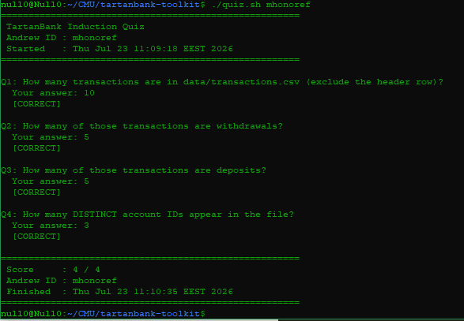

# TARTAN BANK - TOOLKIT
* This project is toolkit for Tartan Bank specifically building scripts to create daily reports

## 1. Quiz result

### QUESTIONS

* **Q1: How many transactions are in data/transactions.csv (exclude the header row)?**
* :10
* **Q2: How many of those transactions are withdrawals?**
* :5
* **Q3: How many of those transactions are deposits?**
* :5
* **Q4: How many DISTINCT account IDs appear in the file?**
* :3

## OVERVIEW
This project is built by combining python and bash scripts to achieve it's goal.
**What was scripted by Bash?**
[run.sh](./run.sh) [secure_creds.sh](./secure_creds.sh) and [setup.sh](./setup.sh) are all bash scripts. In scripts [run.sh](./run.sh) is run daily to create dailry report off all transactions happened during day,  [secure_creds.sh](./secure_creds.sh) hashes plain passphrase using sha256 for security purpose and [setup.sh](./setup.sh) create or confirm workspace is set correctly before running anything.

All scripts are necessarily bash scripts as they deal with core linux functionalities and runnig specific files in linux

**What was programmed in Python?**
We have [bank.py](./src/bank.py) which has Account and Ledger classes that are core for Tartan Bank operations and [process.py](./src/process.py) which is worker and uses methods from core classes to process transactions from [transactions.csv](./data/transactions.csv)

This operations requires programming and that is why python was used instead of scripting it in Bash

### CHALLENGING PART
During implementation of this challenge, the challenging part was keeping track of changes using git but since there was a clear guide and right learning pathway, the process later became straight forward and clear. This is a good tool to version projects.

## Getting started
### Prerequisites
- Linux
- Python3 installed

### Installation
1. clone the repository:
```bash
git clone https://github.com/mwizerwahf/msit-tartanbank-toolkit.git
cd msit-tartanbank-toolkit
```
2. run the daily report generatot script
```bash
./run.sh
```
3. View generated daily report
```bash
cat reports/report_YYY-MM-DD-Tartan-Bank.txt
```